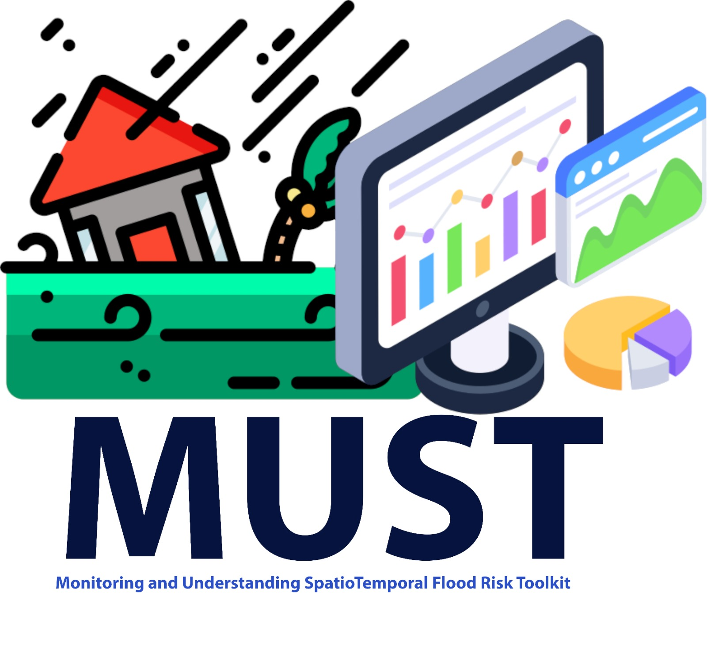

<p align="center">
  
</p>

# MUST — Monitoring & Understanding SpatioTemporal Flood Risk

Interactive toolkit for retrospective flood-risk monitoring and decision support
across East Africa, driven by the ECMWF IFS ensemble.

> ECMWF Code for Earth 2026 — Africa Stream (ArcX)
> Challenge 41: Missed Opportunities in Flood Disaster Risk Management
> Mentors: Nishadh Kalladath · Masilin Gudoshava · Ahmed Amdihun · Anthony Mwanthi · Katherine Egan · Jessica Keune · Hillary Koros

[](LICENSE)

---

MUST is an interactive flood-risk dashboard for East Africa. It lets analysts
replay how flood risk built up over time  day by day, region by region and
check those forecast signals against what actually happened on the ground.

It's built as two connected views:

- Calendar-map index - a GitHub-style calendar where every cell is one forecast
  day, shaded on a traffic light probability ramp. Pick an accumulation window
  (3h…7d) and a return period (2…100yr), scrub or play through the year, and watch
  an admin-1 choropleth recolour alongside a detail card for the day you land on.
- Per-day storymap - a scrollytelling view where a pinned map reacts as you read
  through an event, from the first forecast signal to the eventual impact and the
  decision it should have informed.

The app is flood focused.

How it gets its data

MUST is a standalone application. It doesn't compute risk itself, it depends on
the `grib-icechunks` pipeline for that, consuming its published products through a
small, stable API contract:

- a daily exceedance archive (probability per day, per accumulation window and
  return period),
- admin-1 risk breakdowns for any given day,
- map tiles (raster + vector) for the storymap,
- EM-DAT impact records used to flag days that line up with recorded events.

Because MUST only ever talks to that contract, it runs the same way whether the
data is mocked or live. Out of the box a tiny FastAPI service (`backend/app.py`)
serves a real-shaped sample dataset, so you can run the whole UI locally with
nothing else installed; pointing a couple of environment variables at the live
grib-icechunks endpoints fills the same calendar, choropleth and storymap with
production data.

Quick start

```bash
pip install -r backend/requirements.txt        # fastapi, uvicorn, pandas, pyarrow
yarn install
python backend/generate_exceedance_mock.py     # one-time: build the sample calendar
./scripts/start_dev_servers.sh                 # FastAPI :8000 + Next.js :3000
```

Then open <http://localhost:3000>.

Prefer make? `make install && make mock && make dev` does the same.

Shareable URLs

Every control and every calendar day reflects into the address bar, so any view
you're looking at is a link you can paste to a colleague:

```
/?view=index|story & hazard=flood & window=24h & rp=10yr & date=YYYY-MM-DD
```

The URL ↔ state logic lives in `app/store/url.ts` and is unit-tested.

Project layout

```
app/                 Next.js 14 application (App Router)
├─ page.tsx          entry → DashboardShell (index | story)
├─ store/            URL-synced app state (view / hazard / date / window / rp)
├─ components/
│  ├─ shell/         top bar + brand
│  ├─ index/         calendar, choropleth, day card, playback
│  ├─ story/         scrollytelling map + chapters
│  └─ mdx/           LiveMap tile embed (mock ↔ live)
├─ lib/              data-contract client, colour ramp, fetch helper
└─ styles/           design tokens + component styles

backend/             FastAPI mock service (serves the data contract locally)
├─ app.py            the API
├─ generate_exceedance_mock.py   regenerates the sample calendar
├─ requirements.txt  Python dependencies
└─ data/             generated parquet (gitignored — rebuilt via `make mock`)

scripts/             dev helpers (start both servers, smoke-test the APIs)
public/              map geometry, story assets, mock tiles, brand banner
```

Checks

```bash
make check         # typecheck + lint + tests
# or individually:
yarn ts-check      # tsc --noEmit
npx vitest run     # unit tests (colour ramp + URL round-trip)
yarn build         # production build
```

Citation

If you use MUST in your work, please cite it:

```bibtex
@software{must_2026,
  title   = {{MUST: Monitoring & Understanding SpatioTemporal Flood Risk Toolkit}},
  author  = {Koome, Brian and Ochieng, Mark and Kiluma, Lester and Ashorn, Mikael},
  year    = {2026},
  url     = {https://github.com/Bkoome/MUST-Code-for-earth},
  license = {Apache-2.0},
  note    = {ECMWF Code for Earth 2026 — Challenge 41, Africa Stream (ArcX)}
}
```

License

Licensed under the Apache License 2.0 — see [`LICENSE`](LICENSE).
